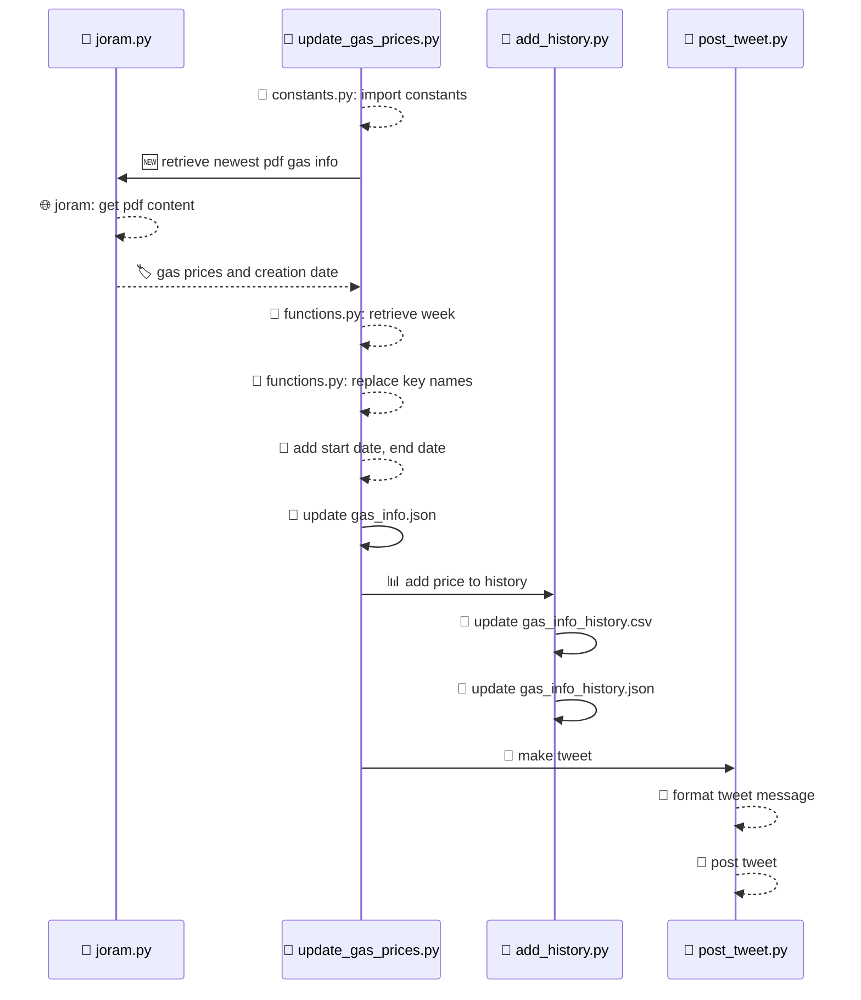

# ⛽️ Devo Abastecer (_beta_)

🇵🇹 Informação acessível com os preços dos combustíveis na Madeira, publicada semanalmente no Twitter recorrendo a um bot.  🇬🇧 Up-to-date fuel prices in Madeira, conveniently updated weekly on Twitter via our automated bot.

## Functionality Overview

This project automates the process of updating and publishing fuel prices in Madeira. The sequence summary below provides an overview of the main functionalities and interactions between components:

