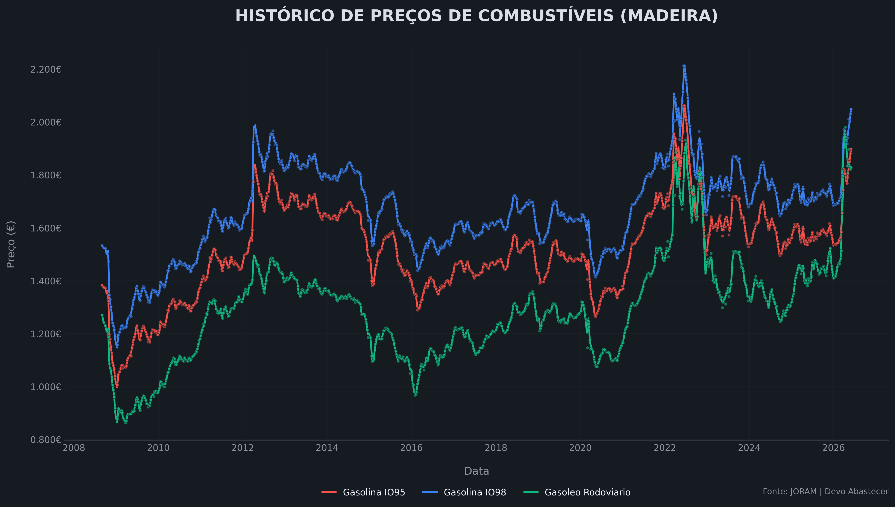
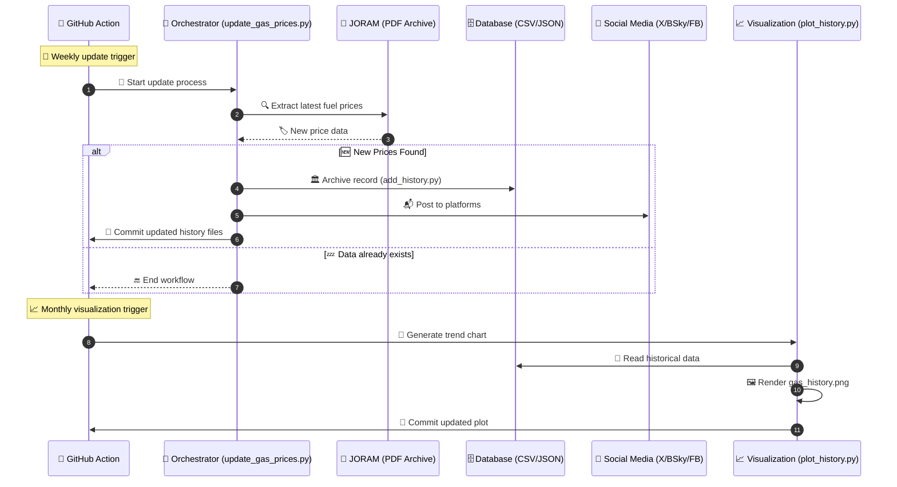

# ⛽️ Devo Abastecer (_beta_)

> [!IMPORTANT]
>
>   

🇵🇹 Informação acessível com os preços dos combustíveis na Madeira, publicada semanalmente no Twitter recorrendo a um bot.  🇬🇧 Up-to-date fuel prices in Madeira, conveniently updated weekly on Twitter via our automated bot.

## Fuel price history

## Functionality Overview

This project automates the end-to-end lifecycle of fuel price monitoring in Madeira. The system is designed for reliability, using GitHub Actions as a serverless orchestrator to handle extraction, archival, and multi-channel publication.

### Workflow

```mermaid
sequenceDiagram
    autonumber
    participant 🤖 GitHub Action
    participant 🐍 Orchestrator (update_gas_prices.py)
    participant 📄 JORAM (PDF Archive)
    participant 🗄️ Database (CSV/JSON)
    participant 📢 Social Media (X/BSky/FB)
    participant 📈 Visualization (plot_history.py)

    Note over 🤖 GitHub Action: 📅 Weekly update trigger
    🤖 GitHub Action ->> 🐍 Orchestrator (update_gas_prices.py): 🚀 Start update process
    🐍 Orchestrator (update_gas_prices.py) ->> 📄 JORAM (PDF Archive): 🔍 Extract latest fuel prices
    📄 JORAM (PDF Archive) -->> 🐍 Orchestrator (update_gas_prices.py): 🏷️ New price data

    alt 🆕 New Prices Found
        🐍 Orchestrator (update_gas_prices.py) ->> 🗄️ Database (CSV/JSON): 🏛️ Archive record (add_history.py)
        🐍 Orchestrator (update_gas_prices.py) ->> 📢 Social Media (X/BSky/FB): 📬 Post to platforms
        🐍 Orchestrator (update_gas_prices.py) ->> 🤖 GitHub Action: 💾 Commit updated history files
    else 💤 Data already exists
        🐍 Orchestrator (update_gas_prices.py) -->> 🤖 GitHub Action: 🔚 End workflow
    end

    Note over 🤖 GitHub Action: 📈 Monthly visualization trigger
    🤖 GitHub Action ->> 📈 Visualization (plot_history.py): 🎨 Generate trend chart
    📈 Visualization (plot_history.py) ->> 🗄️ Database (CSV/JSON): 📖 Read historical data
    📈 Visualization (plot_history.py) ->> 📈 Visualization (plot_history.py): 🖼️ Render gas_history.png
    📈 Visualization (plot_history.py) ->> 🤖 GitHub Action: 📎 Commit updated plot
```
