# ⛽️ Devo Abastecer (_beta_)

🇵🇹 Informação acessível com os preços dos combustíveis na Madeira, publicada semanalmente no Twitter recorrendo a um bot.  🇬🇧 Up-to-date fuel prices in Madeira, conveniently updated weekly on Twitter via our automated bot.

## Functionality overview

### Sequence summary

```mermaid
sequenceDiagram
    participant 🐍 script
    participant 🐍 post_tweet
    participant 🐍 add_history
    participant 🌐 drett

    🐍 script ->> 🌐 drett:GET (HTML content)
    🌐 drett -->> 🐍 script: beautifulSoup object
    🐍 script -->> 🐍 script: extract 📄 from beautifulSoup object
    🐍 script ->> 🐍 script: 💾 gas_info.json
    🐍 script -->> 🐍 script: compare (current date : previous date)
    🐍 script -->> 🐍 script: post a tweet
    🐍 script ->> 🐍 post_tweet: 📄 make_tweet
    🐍 post_tweet -->> 🐍 post_tweet: compare(current price : previous price)
    🐍 script ->> 🐍 add_history: 📄 add_history
    🐍 add_history ->> 🐍 add_history: 💾 gas_info_history.json
    🐍 add_history ->> 🐍 add_history: 💾 gas_info_history.csv

```

### Summary

The `script.py` parses content of DRETT website, and extracts the gas price data it needs using `beautifulSoup` object. Then it opens the `gas_info.json` containing previous data and compares the dates of new and previous data. If the new date is different it then, updates the `gas_info.json` and post a tweet using `post_tweet.py` which also compares the previous price and represents it within the tweet. Finally the script uses `add_history.py` to add the new data to `gas_info_history.{csv,json}`.
